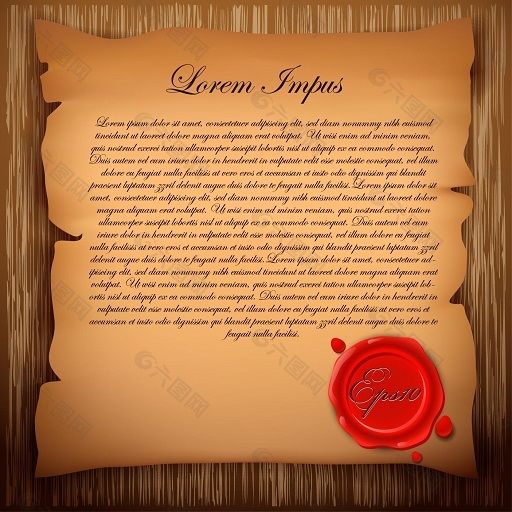

# Paxos岛

&emsp;&emsp;在公元10世纪初，爱琴海的Paxos岛是一个繁荣的商业中心。经济发展带来了政治的进步。Paxos岛的公民们（Paxons）用议会形式的政府取代了古老的神权统治。但是对Paxos岛上的人来说，做生意才是头等大事，没人愿意把自己全部的时间投入到议会事务中，所以议会必须在每个议员都可能随时缺席的情况下也能正常工作下去。

&emsp;&emsp;Paxos岛上的文明已毁灭于一次异族入侵，考古学家只是最近才开始发掘它的历史，我们对Paxos议会的所知因此比较零散。虽然基本协议是知道的，但对许多细节我们却一无所知。如果你对这些细节感兴趣，我就冒昧猜测一下Paxon可能做了什么。

&emsp;&emsp;议会的主要任务是确定这片土地上的法律，法律是由议会通过的一系列法令确定的。一个现代议会会聘任秘书来记录它的每一次活动，但在Paxos，没人愿意在整个会议期间留在议会厅担任秘书。取而代之，每个议员都有一个律簿（ledger），用来记录一系列已通过的法令，每个法令会带有一个编号。例如，议员A如果相信议会通过了第155号法令，那么他的律簿上有这样一条法令：**155: The olive tax is 3 drachmas per ton（橄榄税每吨3元）**。律簿上的法令是用擦不掉的墨水写的，法令是不能更改的。

&emsp;&emsp;议会协议的第一个要求就是律簿是一致的，这意味着没有两个律簿不能有互相矛盾的法令。假设议员B在他的律簿上有一条法令：**132: Lamps must use only olive oil（灯只能使用橄榄油）**，那么就不会有其他议员的律簿上记录不同内容的第132号法令。当然，另一个议员可能还不知道第132号法令已经通过，他可能就不会在他的律簿上记录该法令。

&emsp;&emsp;**仅仅让所有律簿保持一致还不够**，因为让所有律簿都是空白的也能满足一致。**所以还需要一些要求（Requirement）来保证法令能最终通过并被记录在律簿中**。在现代议会中，议员之间的分歧会阻碍法令的通过。但在Paxos不是这样的，这里弥漫着相互信任的气氛，议员愿意通过任何提出的法令。然而他们四处游历的习性带来了一个问题。假如一组议员通过了第37号法令：**37: Painting on temple walls is forbidden（禁止在圣殿墙壁上画画）**，然后全都离开议会厅参加宴会去了。接着，另一组议员进入议会厅，他们对刚才发生的事情一无所知，然后通过了一个冲突的第37号法令：**37: Freedom of artistic expression is guaranteed（允许自由的艺术表达，可以在墙壁上画画）**。这样就失去了一致性。

&emsp;&emsp;除非有足够多的议员在议会厅停留足够长的时间，否则就无法保证律簿一致性（Progress could not be guaranteed）。Paxos的议员不愿意减少他们在外面的活动，所以无法确保任何法令都会最终被通过。然而议员们保证，只要他们在议会厅，他们和他们的助手就会快速处理所有的议会事务。他们定制了如下的议会协议书：**如果议员中的大多数都在议会厅，那么任何法令都会被通过，并且每个已经通过的法令将出现在每一个议员的律簿上（以议员中的大多数作为前提，能够保证对于任意两次的提议，至少存在同一个议员参与了这两次的提议）。**

&emsp;&emsp;只有为议员提供必要的资源，才能实现议会协议的要求。每个议员都收到了一本结实的律簿（用来记录法令，用最好的羊皮纸做的）、一只笔和一些擦不掉的墨水。可能议员离开了议会厅忘记了自己做了什么（议员A在出议会厅后被落下的雕像击中头部，得了失忆症），所以他们会把一些重要的议会任务（notes）记在律簿的背面，这些议会任务是可以被划掉的，但律簿上的法令永远不会划掉。为了让每个议员知道时间过去了多久，他们还收到了简单的沙漏计时器。

&emsp;&emsp;议员随时带着他们的律簿，他们总能从律簿上读到法令和尚未划掉的议会任务。议员还会在小纸条上写下其他笔记，如果他离开了议会厅小纸条会丢失。

&emsp;&emsp;议会厅比较嘈杂听不清，不可能在里面做演讲，只能通过信使来沟通，有专款来供议员雇佣任意多多他们需要的信使。信使不会篡改消息，但是他可能会忘记他递送过了一个消息，然后用重复递送一遍。像他们服务的议员一样，信使也只把一部分时间用于议会职责上。一个信使在递送一个消息前可能会离开议会厅去处理其他的事情--比如一次为期6个月的海上航行。他甚至可能会一去不复返，在这种情况下，消息将永远不会被送达。

&emsp;&emsp;虽然议员和信使可以在任何时候进出议会厅，但当他们进入议会厅时，他们会全身心地投入到议会事务中。只要呆在议会厅，信使会很快的投递消息，议员会立即快速的处理他们收到的消息。

&emsp;&emsp;Paxos的官方声称，议员和信使是绝对诚实的，不诚实的虽然少，但毫无疑问一定是存在的，但由于官方从未提及，我们也不知道议会是怎么应付不诚实的议员或信使的。（这也是Paxos和拜占庭问题的区别。Paxos假设消息会丢失，但在传输过程中不会被篡改；而拜占庭问题则描述的是将军冢存在内奸，消息可能会被篡改。）
